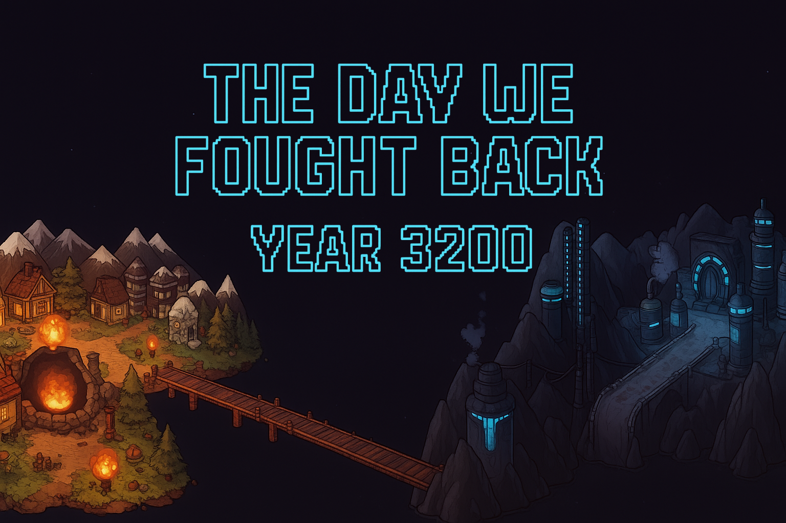

<!-- # The Day We Fought Back - Year 3200 -->




## Project Description

AI has run out of training data, their solution, take it from humans. You are the first to discover this, and must fight back. Will you be able to save humanity?

This project is being developed by students enrolled in CSSE3200 at the [University of Queensland](https://uq.edu.au/ "UQ Home Page") in Semester 2, 2025.

The engine is built on the [libGDX](https://libgdx.com/ "libGDX Information") framework and is developed in Java.

You are welcome to use the game engine for your own purposes. It is released under the [MIT license](https://opensource.org/licenses/MIT "MIT License Description"). Acknowledgment of the source of the game engine is required.

## Course Description

This project is part of the CSSE3200 Software Engineering course at the University of Queensland. The course focuses on practical software engineering skills, including requirements analysis, design, implementation, testing, and project management. Students work in teams to develop a software project, applying the principles and practices learned throughout the course.

---

## Playing the Game

### Option A: Downloading a Build

You can download the latest release of the game as a `.jar` file from the [Releases](https://github.com/UQcsse3200/2025-studio-3/releases).

### Option B: Building from Source

To build the game from source, follow these steps:
1. Clone the repository:
   ```bash
   git clone https://github.com/UQcsse3200/2025-studio-3.git
2. Navigate to the project directory:
   ```bash
    cd 2025-studio-3
3. Build and run the project using Gradle:
   ```bash
    ./gradlew run
    ```

**Prerequisites:**
- Java Development Kit (JDK) 21 or higher
- Gradle (if not using the wrapper)

## How to Play

In the world map menu use **WASD** to move between levels and **ENTER** to select a level.

Once in a level, drag and drop items from the bar up the top to the game grid to place a defense. You must place these in the same row as a robot to deal damage. Each defence deals damage in unique ways so choose wisely!

## Features
- Multiple levels with increasing difficulty
- Slot machine level
- Power-ups and special items

## Quick Useful Commands

### Running the Game

To run the game from the command line, use:
```bash
./gradlew run
```

### Running Unit Tests

To execute the unit tests, use:
```bash
./gradlew check
```

### Format Checker

The format checker must pass before any code is merged. To run the format checker, use:
```bash
./gradlew formatCheck
```

### Auto-formatting Code

If the format checker fails, you can auto-format the code using:
```bash
./gradlew format
```

## Licensing
This project is licensed under the MIT License. See the [LICENSE](LICENSE) file for details.

## Documentation and Reports

- [JavaDoc](https://uqcsse3200.github.io/2025-studio-3/)
- [SonarCloud](https://sonarcloud.io/project/overview?id=UQcsse3200_2025-studio-3)

## AI usage

AI usage for this project can be seen in the [ai](ai/) directory.